# Salary 2045 — Portfolio Tracker
## GIF
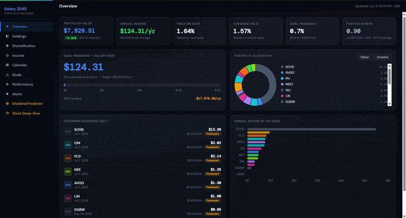

## Screenshots

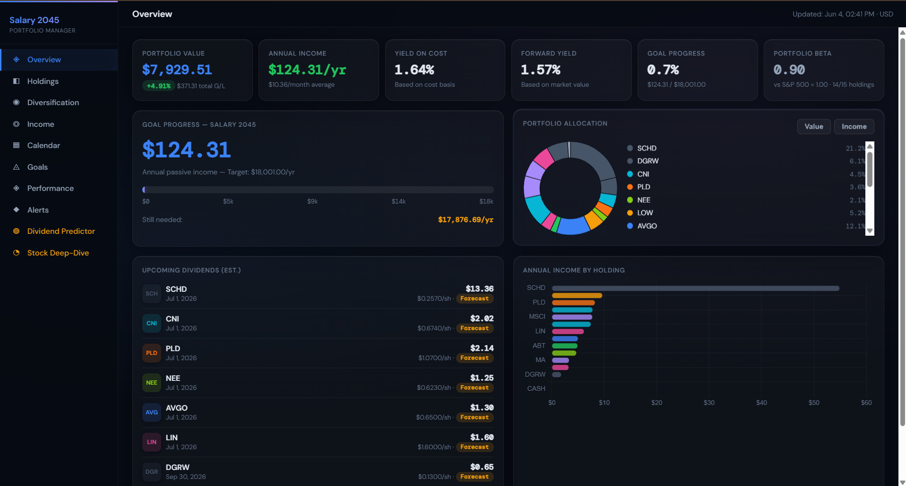
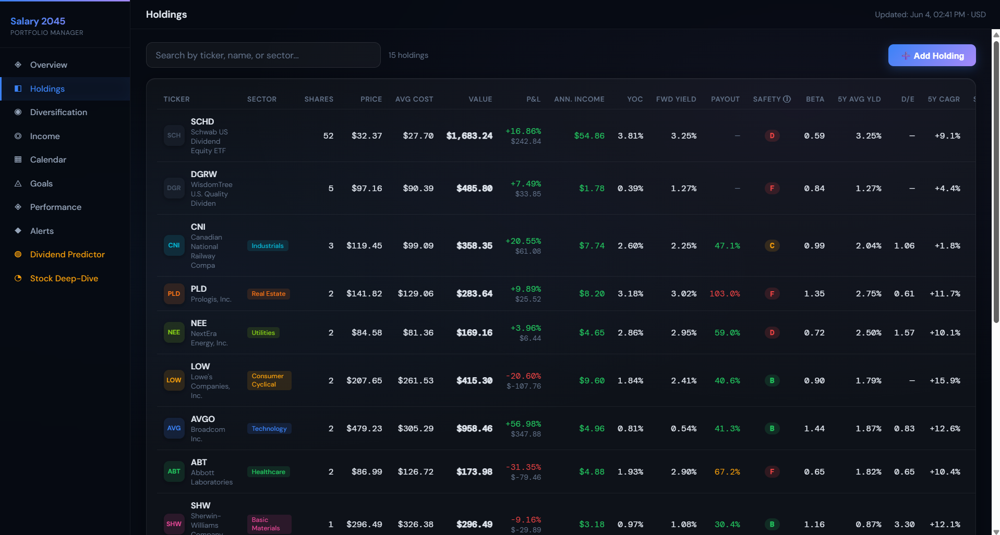
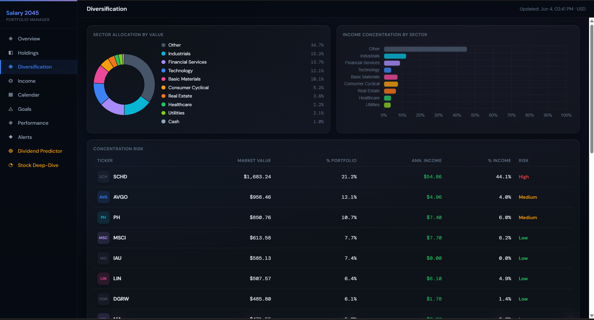
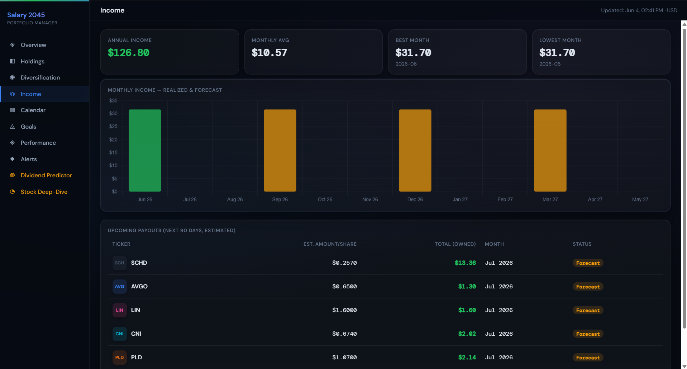
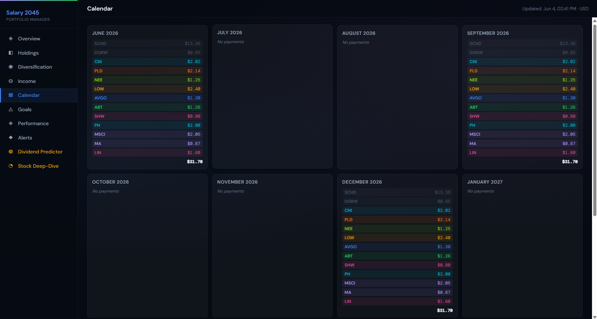
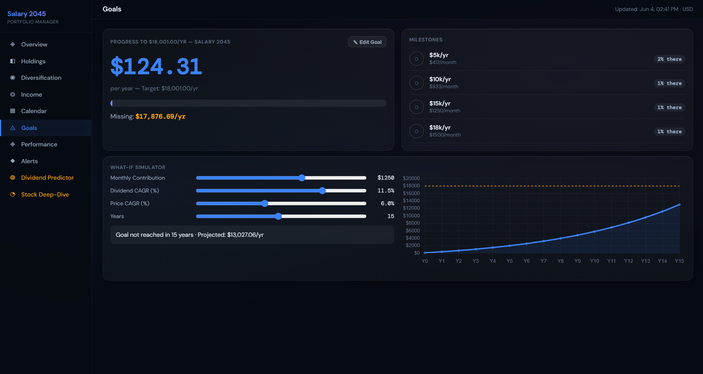
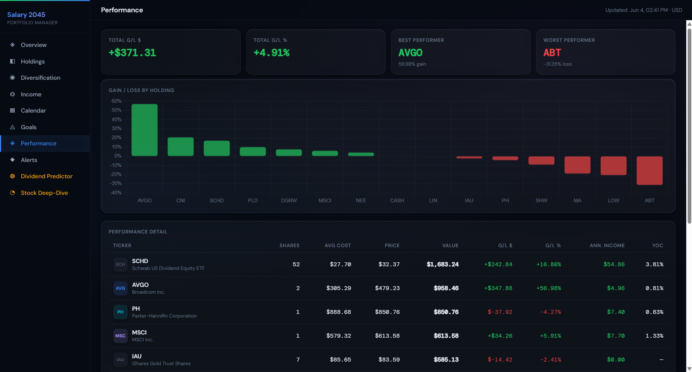
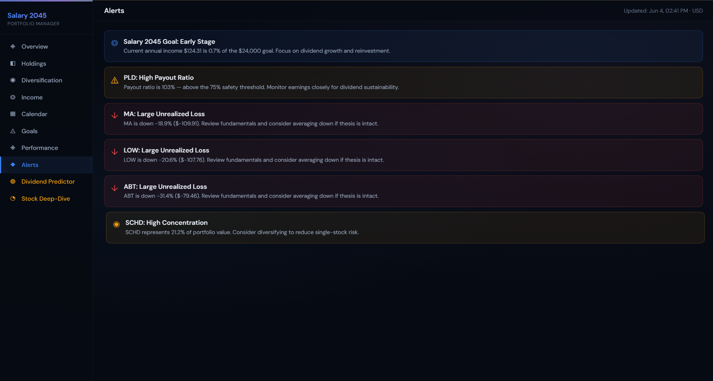
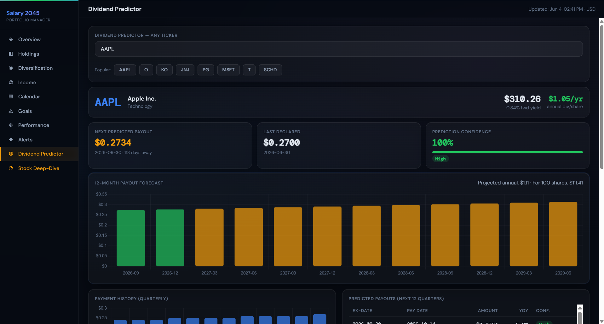
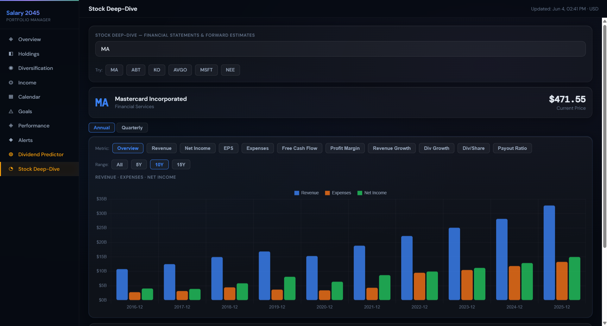

## Background

A self-hosted dividend portfolio tracker built with Flask + yfinance + Chart.js.
Designed for long-term investors who want full visibility into their dividend income,
portfolio health, and progress toward financial independence.

No subscriptions. No cloud. Runs entirely on your machine.


## Features

- **Overview** — Live portfolio snapshot: total value, annual dividend income, yield on cost, forward yield, beta vs S&P 500, and progress toward your passive income goal
- **Holdings** — Full breakdown of each position: current price, gain/loss, dividend yield, annual income per holding, yield on cost, payout ratio, and dividend safety score
- **Diversification** — Sector and industry allocation charts so you can spot concentration risk at a glance
- **Income** — Annual and monthly dividend income breakdown by holding, with historical trends
- **Calendar** — 12-month forward projection of expected dividend payments, month by month
- **Goals** — Set your annual passive income target and track milestone progress
- **Performance** — Portfolio returns vs benchmark over time
- **Dividend Predictor** — 12-quarter forward dividend projection using historical CAGR, with adjustable growth rate assumptions
- **Stock Deep-Dive** — Per-stock financials: revenue, net income, EPS, FCF, payout history, profit margins, dividend growth history, and forward analyst estimates — sourced from both yfinance and Alpha Vantage


## Setup

### 1. Clone the repository

```bash
git clone  https://github.com/GavrielP1/SALARY-2045.git
cd salary2045
```

### 2. Install dependencies

```bash
pip install flask flask-cors yfinance requests python-dotenv
```

### 3. Configure your API key

Get a free API key from [alphavantage.co](https://www.alphavantage.co/support/#api-key), then:

```bash
cp .env.example .env
# Edit .env and replace the placeholder with your actual key
```

### 4. Add your holdings

```bash
cp holdings.example.json holdings.json
# Edit holdings.json with your actual positions
```

Each entry follows this format:
```json
{"ticker": "SCHD", "shares": 10, "avgCost": 75.00}
```

### 5. (Optional) Set your income goal

```bash
cp goal.example.json goal.json
# Edit goal.json to set your annual income target and milestones
```

### 6. Run the app

```bash
python app.py
```

Open [http://localhost:5000](http://localhost:5000) in your browser.

## Files not committed to Git

The following files are listed in `.gitignore` and must be created locally:

| File | Purpose |
|------|---------|
| `.env` | Your Alpha Vantage API key |
| `holdings.json` | Your personal portfolio positions |
| `goal.json` | Your income goal and milestones |
| `portfolio.json` | Auto-generated cache (do not edit) |
| `financials_cache/` | Auto-generated per-ticker cache |

## Notes

- Alpha Vantage free tier: 25 requests/day, 5 requests/minute. The app sleeps between calls automatically.
- `financials_cache/` stores fetched data for 90 days to avoid redundant API calls.
- The CASH holding type is supported: add `{"ticker": "CASH", "shares": 1, "avgCost": 1000}` to represent uninvested cash.
